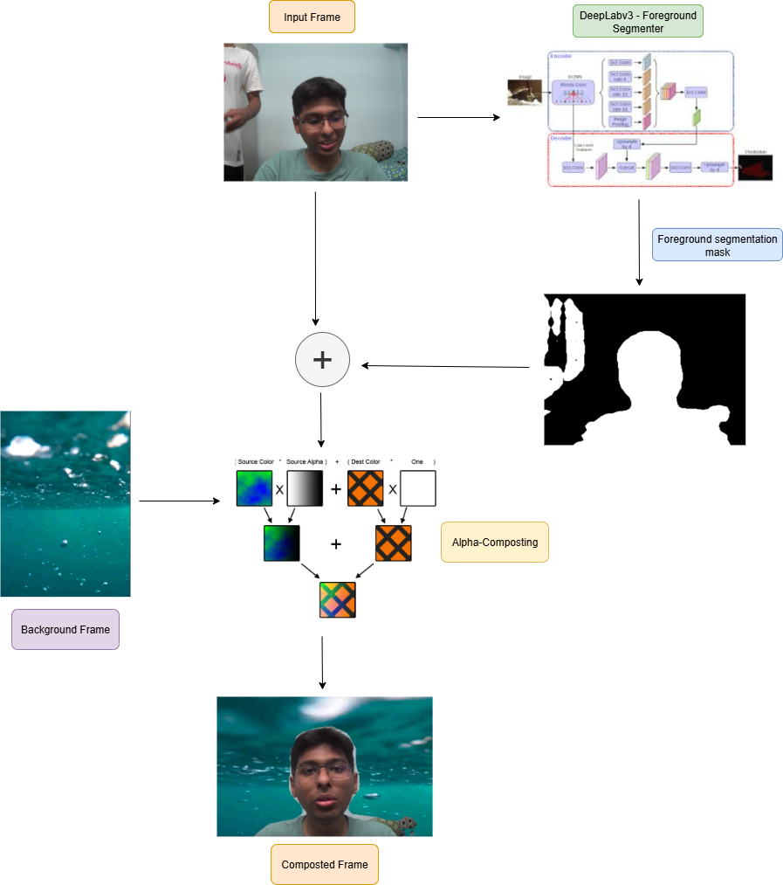

# 💻👤👤 BgReplace-DeepLabv3-AlphaBlending-for-InVideo-background-replacement
This repo is an attempt at reverse engineering the background replacement feature offered by video conferencing sites like zoom. DeepLabv3 was used for precise foreground mask computation and the extracted foreground was elegantly fused with the background image/gif by an old school computer vision technique called AlphaBlending.

# Demo 👇
<video src="demo.mp4" controls width="640"></video>
[[Link to Demo]](https://youtu.be/RqFwmqA6Rvw "Click to watch")

# Overview of the pipeline

